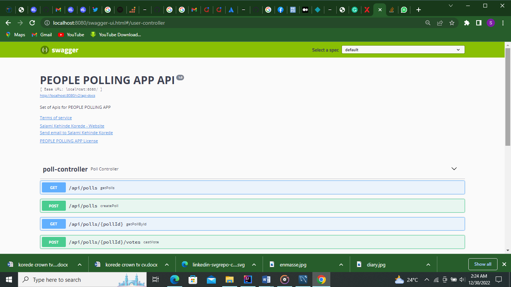
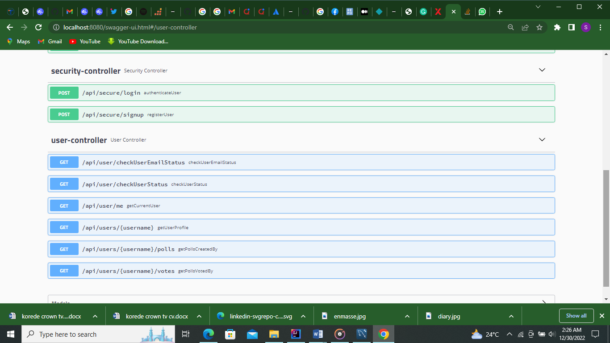

# PEOPLE-DECISION-POLL API

POLLING APP 

POLLING Service is a set of APIs for users to set poll to weigh opinions concerning trending issues.

System Functionality
This project is developing a layered monolith Spring Boot based project (with the version 2.7.2), on Java 11, and with an embedded database mode.

This project is an OAuth2 based project, using JWT token to secure endpoints. So you need to signup first to continue using the system.

The functionality is reached based on users role
Poll-setter User: user is a predefined user

 Users needs to log-in first through /login API to get their token to contact the system.
This user can set up a poll

Poll-setter manages the poll and also sets time that the poll will expire

Users can votes and decide the way forward.

Required software
The following are the initially required software pieces:

Maven: it can be downloaded from https://maven.apache.org/download.cgi#.

Git: it can be downloaded from https://git-scm.com/downloads.

Java 18.0.0: it can be downloaded from https://www.oracle.com/java/technologies/downloads/#java18.

Cloning It
Now it is the time to open terminal or git bash command line, and then clone the project under any of your favorite places with the following command:

> git clone https://github.com/Kordedekehine/people-decision-poll.git
> 
Using an IDE

I recommend that you work with your Java code using an IDE that supports the development of Spring Boot applications such as Spring Tool Suite or IntelliJ IDEA Community | Ultimate Edition.

All you have to do is fire up your favorite IDE -> open or import the parent folder people-decision-poll, and everything will be ready for you.

Technologies
Spring (Boot, Security, Data JPA, )
Hibernate
SQL
Lombok
Maven
Swagger

Setup
Prerequisites
Java 11